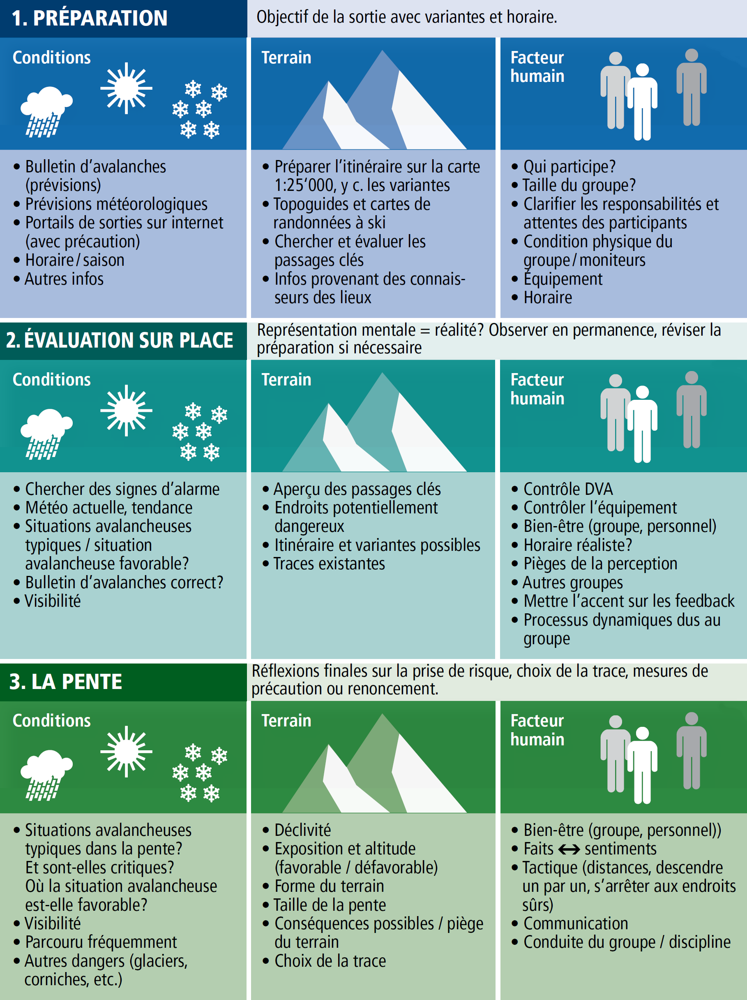
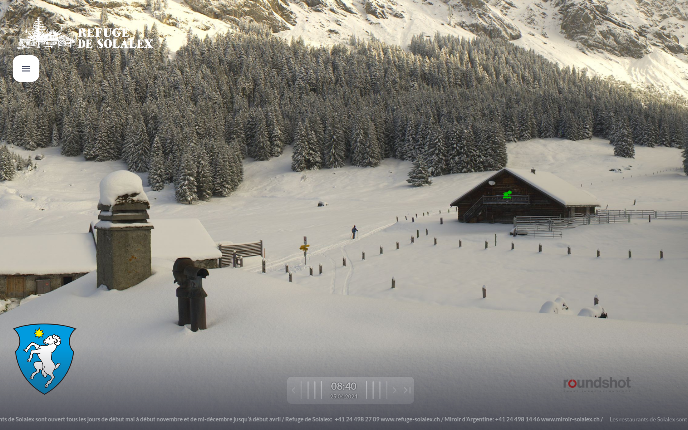
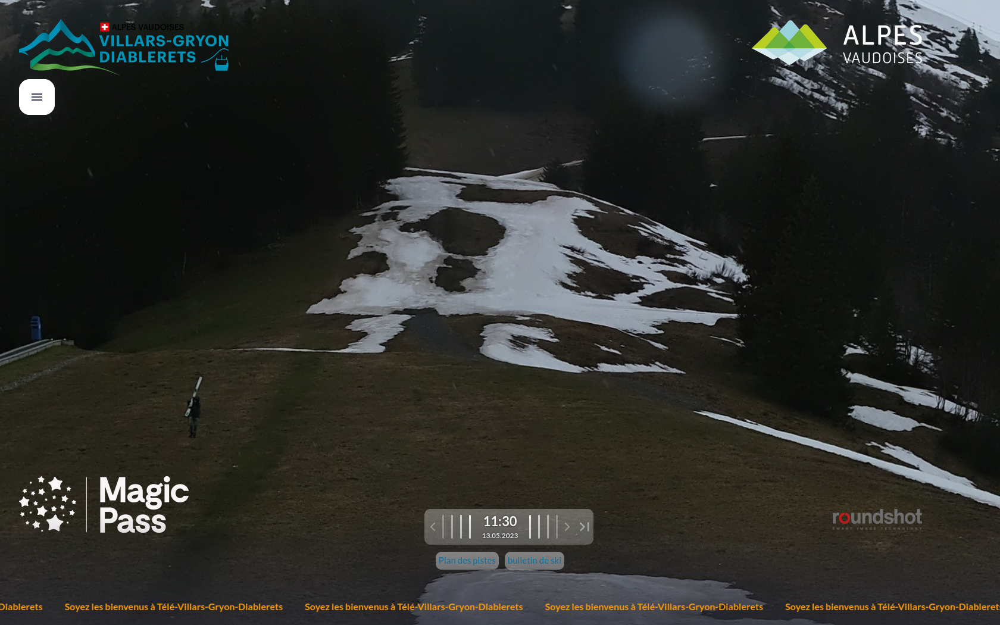

# Grille 3x3
## grille pour évaluation et prise de décision

La grille 3x3 de Werner Munter constitue la base de la science des avalanches moderne. Selon ce schéma,
une sortie est morcelée en trois phases préparation, évaluation sur place et pente. Dans chaque phase il
s’agit d’évaluer les trois facteurs conditions, terrain et facteur humain.

---

---

---
  > Citation de mes paroles quand le silence est d'or

[back](./)
